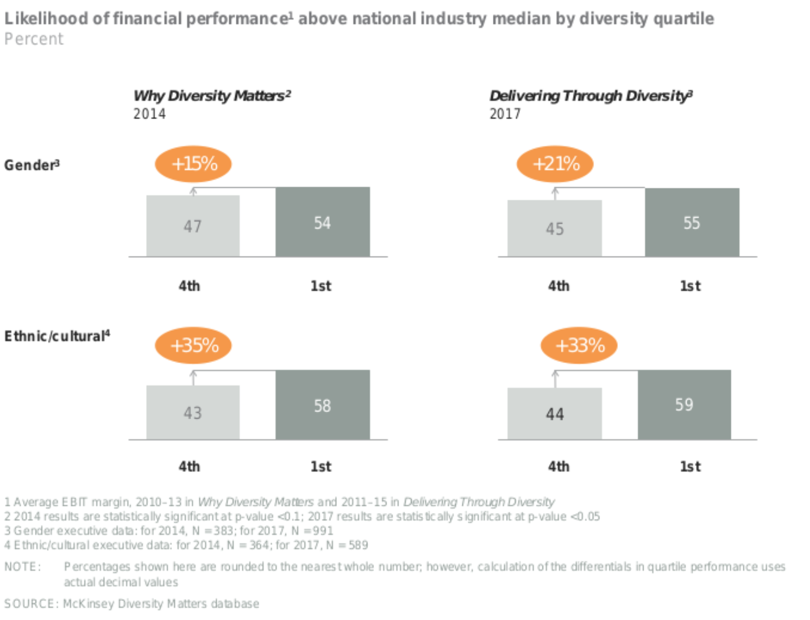

__[źródło](http://www.tokkoro.com/3000087-black-and-white_people_three.html)__

# Co trzech białych mężczyzn może zrobić w kwestii różnorodności

Temat różnorodności, należy do tematów przy którym często w narracji posługujemy się emocjami. Emocje z natury przedstawiają poglądy czy pojedyncze opinie. Dzięki czemu przestrzeń w której przebywamy na co dzień, jest nie tylko urozmaicona ale również bardzo złożona. To dzięki różnorodności właśnie ludzie są skłonni, do rozmaitych wniosków. Przez co dyskusja przybiera różne oblicza, od stonowanej wymiany argumentów, poprzez burzliwą wymianę zdań, po ciszę. Czyli brak głosu w obawach przed niezrozumieniem. Aby pomóc w podtrzymaniu głosu i prowadzenia merytorycznej dyskusji chcemy podzielić się następującymi faktami w odniesieniu do dysproporcji płci w sektorze IT.

__[źródło](https://www.pexels.com/photo/group-hand-fist-bump-1068523/)__

## Różnorodność jest potrzebna

Istnieje statystycznie znacząca korelacja pomiędzy różnorodnym zespołem zarządczym, a ponad standardowymi wynikami finansowymi osiąganymi przez firmy”. Taka zależność trwa nieprzerwanie od kilku lat, i została opisana w raporcie McKinsey & Company - “Why Diversity Matters” z 2014 roku. W styczniu 2018 roku McKinsey & Company opublikowało kolejny raport: [“Delivering Through Diversity”][1], który dodaje kilka nowych obserwacji: firmy plasują się powyżej 25% organizacji zróżnicowanych pod względem płci osiągały lepsze wyniki finansowe, jak i tworzyły znacząco lepsze produkty.  

Różnorodność nie powinna być postrzegana wyłącznie jako kwestia wizerunkowa, dbająca o dobry PR. Możemy opierać się na konkretnych badaniach, na danych, które jednoznacznie pokazują korzyści z budowania zróżnicowanych zespołów. Nie ma dwóch identycznych osób i każdy ma do zaoferowania  coś osobistego. Aby zrealizować zadane cele, potrzebujemy korzystać z różnych poglądów, doświadczeń, metod. Wyjść poza homogeniczny, jednolity zespół i czerpać wiedzę z więcej niż pojedynczego źródła.

## Kobiety wcale nie mają łatwiej

W tym momencie zaczynają podnosić się głosy: nieprawda, jest dobrze, nie wolno sztucznie promować różnorodności (w domyśle kobiet) w jakikolwiek sposób, szczególnie finansowy. Przecież, szczególnie w IT, wszyscy mają tak samo.

A jednak nie.

Uniwersytet Stanfordu przeanalizował, ponad sto podsumowań rozmów okresowych, [(performance reviews)][2], z których wynika, że mężczyźni przeszło dwukrotnie częściej niż kobiety otrzymują informację zwrotną odnoszącą się do ich kompetencji. Z raportu wynika też, że osiągnięcia kobiet są równie często postrzegane jako “kolektywne osiągnięcia zespołu”, co powoduje rozmycie ich zasług.

__[źródło](https://www.pexels.com/photo/caution-danger-information-safety-258063/)__

Niestety, statystycznie kobiety zdecydowanie częściej otrzymują negatywną informację zwrotną, niż taką nastawioną na rozwój. W takim środowisku nie da się wzrastać, rozwijać i pracować wydajnie. Co jest ciekawe, firmy, brane pod uwagę w raporcie, same zwróciły się o udział w nim.  

__[źródło](https://www.pexels.com/photo/business-dirty-door-security-241028/)__

Wiele organizacji ma świadomość, że informacja zwrotna jest często stronnicza (ang. biased). Tego rodzaju zachowania są często nieuświadomione, trudne do kontrolowania i jeszcze trudniejsze do wyeliminowania. Dlatego należy szukać sposobów, aby ludzie siebie wzajemnie wspierali oraz inspirowali. Jedną z takich metod może być przyjęcie transparentnego i spójnego systemu wartościowania pracowników.

Firmy same zaczynają szukać sposobów rozwiązania problemu wyrównania szans. Dla przykładu firma Pivotal, gdzie dokonuje się aktywnych starań aby wynagrodzenia pracownicze były [zależne od zakresu obowiązków][3]. Manager pracujący w Pivotal, zostaje wyposażony w narzędzia, dzięki którym może kształtować polityki wynagradzania, zatrudnienia czy motywowania, przez co aspekty rasowe, kulturowe są [automatycznie wykluczane][3]. Takie działanie zdobywa coraz większe uznanie, wśród społeczności IT.

## Co trzech białych mężczyzn może zrobić w kwestii różnorodności

Dochodzimy do sedna. Czy w środowisku zdominowanym przez mężczyzn (takim jak IT, ale pewnie możemy odnieść to do wielu innych branż np. z nad reprezentacją jednej z płci), sami mężczyźni mogą coś zdziałać w kierunku różnorodności?. Sądzimy, że wiele.

__[źródło](https://www.pexels.com/photo/black-and-white-dark-decoration-faces-134402/)__

Przede wszystkim nie pozostawiać spraw samym sobie, lecz na każdym kroku wykazywać się możliwie największą dozą empatii. Tylko dzięki temu możemy dojść do sedna problemu i tworzyć środowisko dostępne i przyjazne dla wszystkich. Nie poprzez odgórne nakazy (parytety) ale poprzez działania u podstaw i próby dojścia do sedna problemu.

## Dlaczego my?

Nasza inicjatywa ma na celu, przyciągnąć ludzi o otwartych umysłach, z różnym wykształceniem, o różnej płci, orientacji seksualnej i przynależności etnicznej. Te różnorodności umożliwiają nam poznawanie problemów w szerszej perspektywie i przełamywanie standardowych sposobów myślenia.

Na nas, jako organizatorach spotkań, spoczywa dodatkowy obowiązek znalezienia oraz zaproszenia utalentowanych ludzi z całego świata, zachęcając ich do mobilności między różnymi lokalizacjami, zapewniając okazję do wymiany poglądów. Wynikiem tego jest środowisko, w którym ceni się i celebruje różnorodność.

Bogactwo punktów widzenia i szeroka wiedza specjalistyczna są podstawą naszego sukcesu. To właśnie różnorodność umożliwia nam sprostanie wielu złożonym wyzwaniom technologicznym, na które natrafiamy na co dzień. Pragniemy, aby spotkania branży IT były miejscem, w którym różnorodność jest przewagą, dzięki której kreatywne dyskusje pozwalają wyłonić się nowym pomysłom.

__[źródło](https://www.pexels.com/photo/light-bulb-against-white-background-247753/)__

## Co dalej?

[Napisz do nas](mailto:hi@fajny-projekt.pl) i działajmy dalej wspólnie!

Pomożemy Ci w wypracowaniu swojej pierwszej lub kolejnej prezentacji.

Zacznijmy razem pracować nad nową formuła spotkań, opartą o środowisko bezpieczne dla każdego uczestnika.

Autorzy:
[Marcin Grzejszczak](https://www.linkedin.com/in/marcin-grzejszczak-15565119/), [Damian Leszczyński](https://www.linkedin.com/in/dleszczynski/) i [Jakub Marchwicki](https://www.linkedin.com/in/kubamarchwicki/)

PS. [Nasze code of conduct](http://pl.communitycodeofconduct.com/)

[1]: https://www.mckinsey.com/~/media/mckinsey/business%20functions/organization/our%20insights/delivering%20through%20diversity/delivering-through-diversity_full-report.ashx
[2]: http://www.businessinsider.com/gendered-language-in-performance-reviews-2015-10?IR=T
[3]: https://content.pivotal.io/blog/pay-transparency-and-pay-equity-new-measures-and-progress
